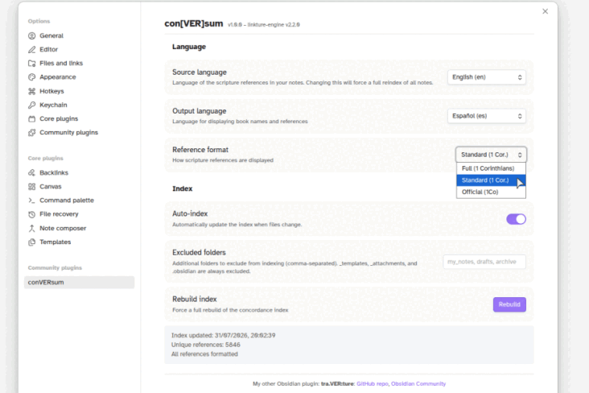

> **Beta Notice:** This is a *beta* release. I would greatly appreciate if you could [report issues and/or suggestions](https://github.com/erykjj/conversum/issues).

 

# con[VER]sum – Obsidian plugin

> **conversum** (n.): That which has been turned together — a unified index formed from scattered parts. From Latin *con-* ("together") + *vertere* ("to turn") + *-sum* (result/outcome).

A scripture reference parser and cross-linker for Obsidian. Turn scattered Bible references into a unified concordance. Automatically discovers, indexes, and links scriptures across all your notes. *Colligere et connectere* ("To gather and connect").

## Security and Privacy

If you are concerned about the "Scorecard" review or the "Caution" warning on the [Obsidian Community plugins page](https://community.obsidian.md/plugins/conversum), see [SECURITY](https://github.com/erykjj/conversum?tab=security-ov-file).

---

**Important:** Set your source and output languages and format before enabling auto-index. The initial index build may take 5 minutes or more on a vault with many notes.

## Features

- **Automatic reference detection** – Scripture references are automatically detected in both View and Edit modes. Works with most book name variants and common abbreviations (e.g., "2 Sam.", "II Samuel", "2Sa"). References can also be force-detected by wrapping them in `{{ }}` (e.g., `{{Song of Solomon 1:1}}`). See [Known Limitations](#known-limitations) for edge cases.

- **Searchable concordance** – Browse and filter references by book, chapter, or verse. All references are indexed for fast retrieval.

- **Find related notes** – Right-click any valid reference to see all notes that mention that reference, including containing ranges (e.g., "Mat. 5:3-5" will find notes with "Matthew 5:1-10").

- **Export to Markdown** – Generate a complete concordance as a Markdown file for reference or printing.

- **Multi-language support** – Handle references in any supported language, and display book names in a different language.
  - Supported languages: Cebuano, Danish, Dutch, English, Estonian, French, German, Haitian Creole, Hungarian, Italian, Japanese, Korean, Mandarin Chinese (simplified), Norwegian, Polish, Portuguese, Romanian, Russian, Spanish, Swedish, Tagalog, Ukrainian

- **Per-note language override** – Set a `language` property in the frontmatter (meta-data) of any note to override the source language for that specific file.

- **Desktop and mobile support**

---

## Settings

- **Source language** – Language of the scripture references in your notes. Changing this will force a full reindex.
- **Output language** – Language for displaying book names in the concordance view and export.
- **Reference format** – How scripture references are displayed (Full, Standard, Official).
- **Auto-index** – Automatically update the index when files change. Disable this while setting up your source language to avoid unnecessary reindexing.
- **Excluded folders** – Additional folders to exclude from indexing. `_templates`, `_attachments`, and `.obsidian` are always excluded.
- **Rebuild index** – Force a full rebuild of the concordance index.

---

## Known Limitations

- **Right-click menu in reading mode** – Due to an Obsidian limitation, the menu position in reading mode is offset slightly so as not to conflict with the menu from the [tra.VER:ture plugin](https://github.com/erykjj/traverture) (if installed).
- **Whole books** (like "James") are not detected unless preceded by a number (e.g., "1 John"). Use braces if detection is desired (e.g., `{{Obadiah}}`).
- **"Song of Solomon"** and its variants are not auto-detected. Use `{{Song of Solomon 1:1}}` to force detection.
- **Ambiguous references** like "1 John 5:3; 2 John 4" may parse incorrectly as "1 John 5:3; 2" (as in, 1 John chapter 2) and "John 4". Force detection with braces: `1 John 5:3; {{2 John 4}}`.

---

## Installation & Updating

1. In your vault's `.obsidian/plugins/` directory, create a folder called `conversum` if it doesn't already exist.
2. Download [main.js](https://github.com/erykjj/conversum/releases/latest/download/main.js), [styles.css](https://github.com/erykjj/conversum/releases/latest/download/styles.css), and [manifest.json](https://github.com/erykjj/conversum/releases/latest/download/manifest.json) and place them in that folder (overwriting existing files to update).
3. If not already enabled, enable the plugin in Obsidian Settings → Community plugins.
4. Configure source and output languages in the plugin settings, then enable auto-indexing.

---

## Feedback, etc.

Feel free to get in touch and post any [issues and/or suggestions](https://github.com/erykjj/conversum/issues).

My other Obsidian plugin: **tra.VER:ture**: [GitHub repo](https://github.com/erykjj/traverture), [Obsidian Community](https://community.obsidian.md/plugins/traverture)